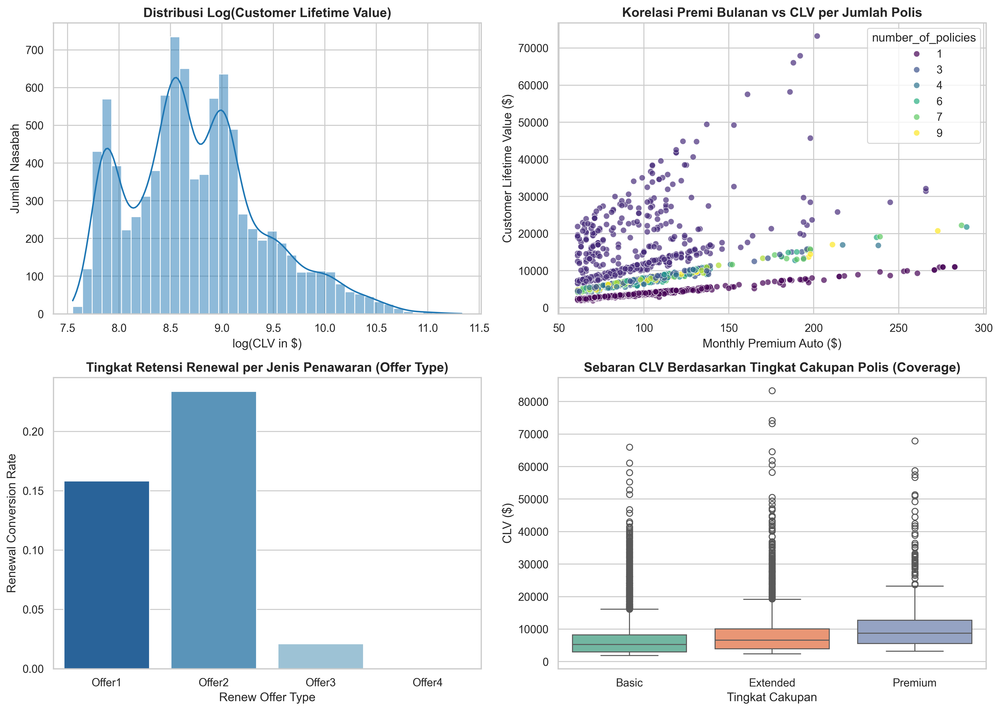
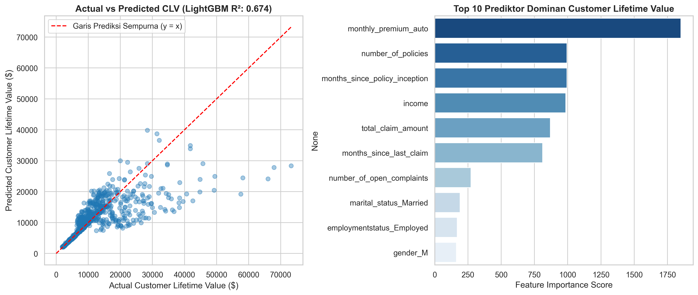
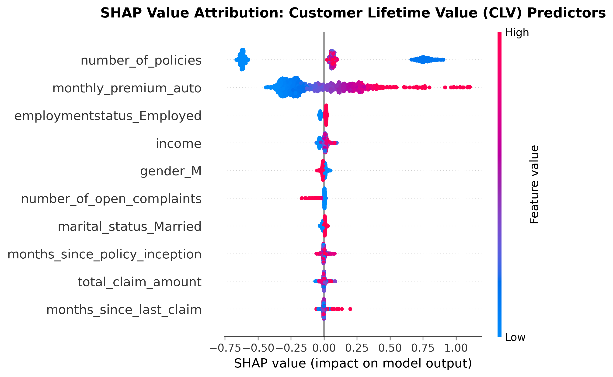

# Insurance Customer Lifetime Value (CLV) & Policy Renewal Analytics

[](https://www.python.org/)
[](https://lightgbm.readthedocs.io/)
[](https://scikit-learn.org/)
[](#)
[](#)

Repositori ini mengimplementasikan sistem estimasi nilai seumur hidup nasabah (*Customer Lifetime Value / CLV Prediction*) dan analitik retensi pembaruan polis (*Policy Renewal Optimization*) pada portofolio asuransi kendaraan bermotor menggunakan data resmi IBM Watson Marketing.

---

## 1. Domain Bisnis & Formulasi Masalah

Dalam industri asuransi, mempertahankan nasabah bernilai tinggi (*high-CLV retention*) jauh lebih hemat biaya dibandingkan akuisisi nasabah baru. Nilai CLV merupakan proyeksi kontribusi margin laba bersih kumulatif yang dihasilkan nasabah selama masa pertanggungan aktif.

### Formulasi Masalah & Transformasi Target:
* **Input**: 21 variabel penjelas (premi bulanan `monthly_premium_auto`, jumlah polis `number_of_policies`, total nominal klaim historis `total_claim_amount`, pendapatan, jenis kendaraan, dan saluran penjualan).
* **Target Kontinu**: `customer_lifetime_value` (dalam USD).
* **Stabilisasi Varians Log-Normal**:
  Karena distribusi CLV bersifat *heavy-tailed* dan menceng ke kanan (*right-skewed*), target ditransformasi menggunakan fungsi logaritmik saat pelatihan model prediktif untuk menstabilkan varians residual:

$$\tilde{y} = \log(1 + \text{CLV}), \quad \widehat{\text{CLV}} = \exp(\hat{y}) - 1$$

---

## 2. Struktur Repositori

```
├── .gitignore          # Konfigurasi pengabaian cache Git
├── data/               # Dataset mentah (WA_Fn-UseC_-Marketing-Customer-Value-Analysis.csv)
├── images/             # Grafik plot hasil render dari Jupyter & SHAP (300 DPI)
├── models/             # Binary model pipeline ter-serialize (clv_pipeline.joblib)
├── src/                # Modular Python inference engine (CLVEngine)
├── tests/              # Automated unit tests (Pytest)
├── notebook.ipynb      # Mesin pemrosesan: Impor, olah data, perhitungan statistik, dan pemodelan
└── README.md           # Laporan utama: Pembahasan bisnis, rumus, tabel metrik, grafik tersemat, dan rekomendasi
```

---

## 3. Hasil Analisis CLV & Retensi (EDA)

Berdasarkan eksplorasi terhadap 9.134 profil nasabah asuransi kendaraan:



### Temuan Profil Kunci:
* **Premi Bulanan & Jumlah Polis (`Monthly Premium Auto` & `Number of Policies`)**: Merupakan dua pendorong (*key drivers*) paling dominan terhadap lonjakan nilai CLV nasabah.
* **Efektivitas Penawaran Renewal (`Renew Offer Type`)**: Penawaran **Offer 2** menghasilkan tingkat konversi renewal tertinggi (mencapai >23%), sedangkan Offer 4 memiliki tingkat respons terendah (<3%).
* **Tingkat Cakupan Polis (`Coverage`)**: Nasabah dengan cakupan *Premium* menghasilkan median CLV jauh lebih tinggi dibandingkan *Basic* atau *Extended*.

---

## 4. Hasil Evaluasi Model & Tabel Metrik

Evaluasi performa model diuji pada data pengujian terisolasi (*holdout test set* 20%, 1.827 sampel) dan diukur langsung pada skala dolar riil:



### Perbandingan Model Prediktif:

| Arsitektur Model | Koefisien Determinasi ($R^2$) | Root Mean Squared Error (RMSE) | Mean Absolute Error (MAE) | Karakteristik Operasional |
| :--- | :---: | :---: | :---: | :--- |
| **Random Forest Regressor** | **0.6784** | **$4,071.37** | **$1,409.60** | **Model Terbaik**: Presisi tinggi pada segmen multi-policy |
| **LightGBM Regressor** | **0.6742** | $4,097.58 | $1,432.31 | Sangat cepat untuk skenario inferensi real-time |
| **Ridge Linear Baseline** | 0.0952 | $6,828.67 | $3,668.06 | Gagal menangkap efek interaksi non-linear |

---

## 5. Explainable AI: SHAP Value Attribution

Visualisasi faktor penentu besaran nilai finansial CLV nasabah:



---

## 6. Implementasi Modular & Pengujian Otomatis

Modul inferensi CLV tersedia di `src/clv_engine.py`:

```python
from src.clv_engine import CLVEngine
import pandas as pd

engine = CLVEngine()
sample = pd.read_csv('data/WA_Fn-UseC_-Marketing-Customer-Value-Analysis.csv', nrows=1)
predicted_clv = engine.predict_clv(sample)
print(f"Prediksi Nilai Seumur Hidup Nasabah: ${predicted_clv[0]:,.2f}")
```

Jalankan automated test:
```bash
pytest tests/
```

---

## 7. Rekomendasi Bisnis & Strategi Retensi Portofolio

1. **Segmentasi Nasabah Berbasis Kuadran CLV**:
   * **Platinum Tier (CLV > $12.000)**: Terapkan layanan *Dedicated Relationship Manager* dan penawaran renewal eksklusif (*Offer 2*) 60 hari sebelum masa polis berakhir.
   * **Growth Tier (CLV $5.000 - $12.000)**: Fokus pada strategi *multi-policy bundling* (menambah jumlah polis mobil kedua atau asuransi properti) untuk menaikkan tier ke Platinum.
2. **Standardisasi Penawaran Renewal**:
   * Evaluasi ulang atau hapus proposal renewal bertipe *Offer 3* dan *Offer 4*, lalu prioritaskan struktur insentif pada *Offer 1* dan *Offer 2*.
3. **Pemberian Diskon Retensi Berbasis Margin CLV**:
   * Alokasikan diskon pembaruan polis secara selektif hanya pada nasabah yang memiliki rasio *Claim-to-CLV* rendah guna mempertahankan profitabilitas underwriting.

---

## 8. Panduan Menjalankan

1. **Pasang Dependensi**:
   ```bash
   pip install -r requirements.txt
   ```

2. **Eksekusi Notebook**:
   ```bash
   jupyter notebook notebook.ipynb
   ```

---
*Proyek 05 dari Seri 5 Portofolio Data Science Industri Asuransi.*
